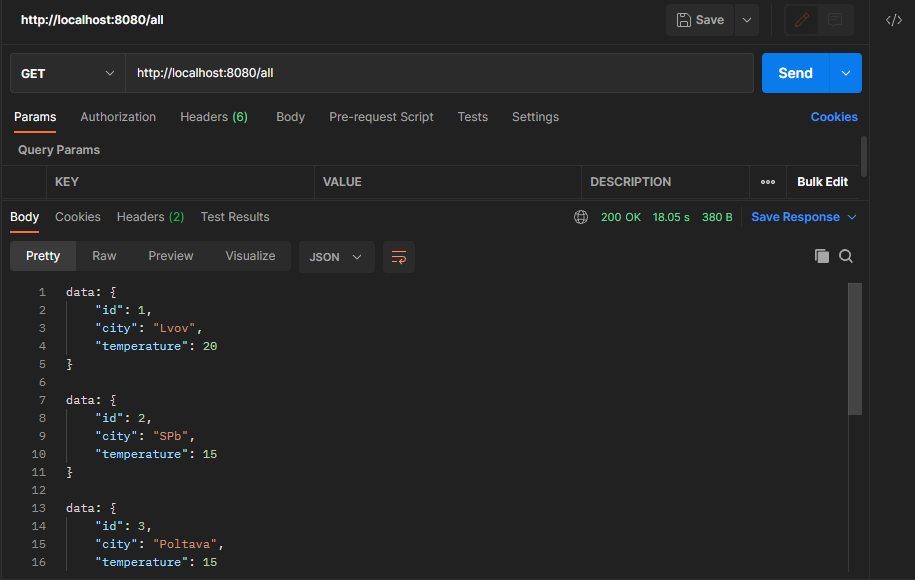
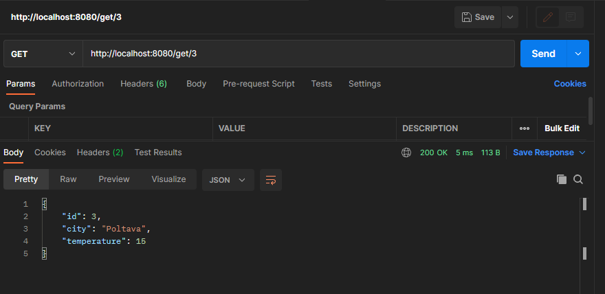
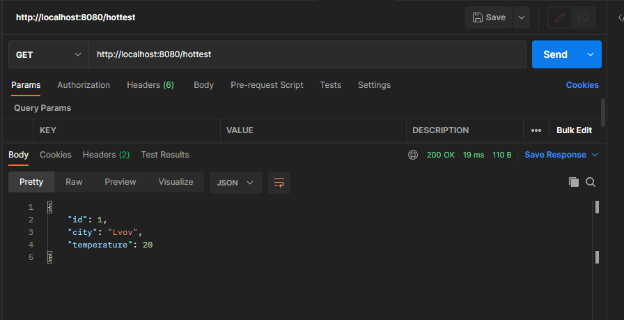
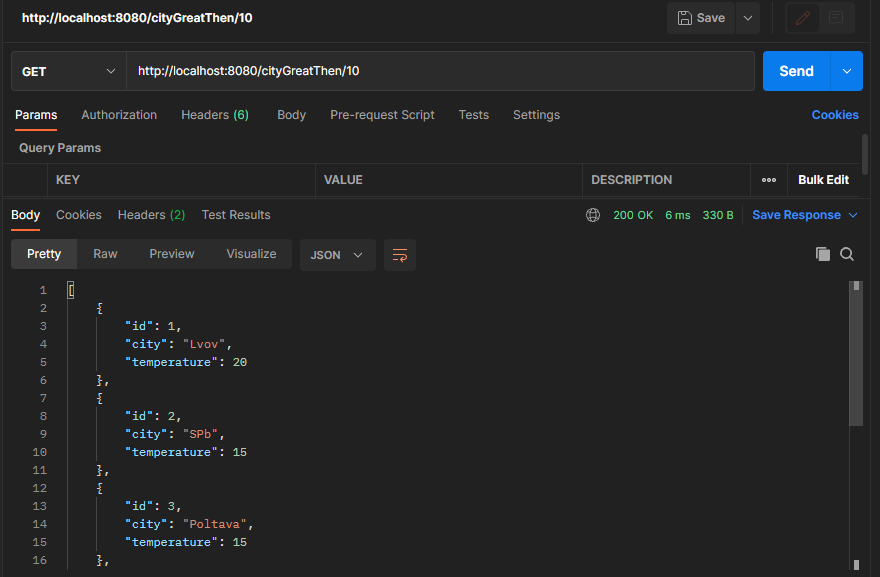

# Project "Weather Reactive"

<p>This project represents system that built in reactive programming mode FlUX and MONO</p>

### Functionality:

* Publication of weather data by city
* Getting the highest temperature in a list of cities
* Getting cities with a given temperature limit
* Making requests with Postman

### Assembly and installation:

```shell
mvn spring-boot:run
```

### TODO list

The program can:

1. See the weather for all cities in the database. GET request http://localhost:8080/all
2. Search for a city by its number in the database. GET request http://localhost:8080/get/id, where id is the number in
   the database
3. Search for a city with weather where the maximum temperature is. GET request http://localhost:8080/hottest
4. Search for cities with weather greater than the specified temperature GET
   request http://localhost:8080/cityGreatThen/t, where t - \
   required temperature.

### Used technologies:


### Screenshots






### Contact:

If you have any questions, feel free to contact me https://t.me/VadimDedeyko


<!-- 
brightgreen
green
yellowgreen
yellow
orange
red
blue
lightgrey
success
important
critical
informational
inactive
blueviolet
ff69b4
9cf 
-->